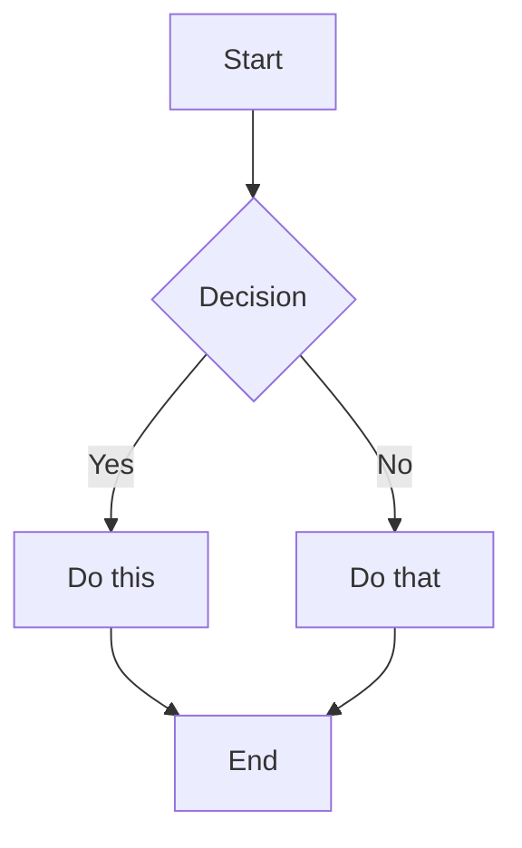
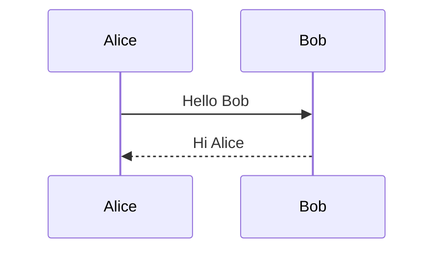
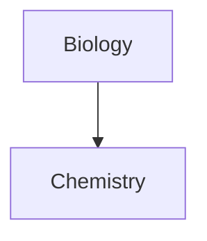
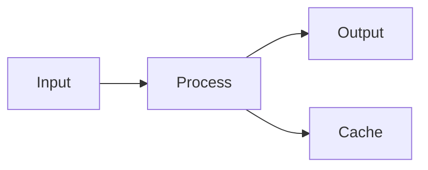

# Obsidian 风格的Markdown语法技能

这项技能使Agent能够创建并编辑有效的 Obsidian 风格 Markdown，包括所有 Obsidian 特有的语法扩展。

## 概述

Obsidian 使用了多种 Markdown 格式:
- [CommonMark](https://commonmark.org/)
- [GitHub Flavored Markdown](https://github.github.com/gfm/)
- [LaTeX](https://www.latex-project.org/) for math
- Obsidian-specific extensions (wikilinks, callouts, embeds, etc.)

## 基础格式

### 段落和换行

```markdown
This is a paragraph.

This is another paragraph (blank line between creates separate paragraphs).

For a line break within a paragraph, add two spaces at the end  
or use Shift+Enter.
```

### 标题

```markdown
# Heading 1
## Heading 2
### Heading 3
#### Heading 4
##### Heading 5
###### Heading 6
```

### 文本格式

| Style | Syntax | Example | Output |
|-------|--------|---------|--------|
| Bold | `**text**` or `__text__` | `**Bold**` | **Bold** |
| Italic | `*text*` or `_text_` | `*Italic*` | *Italic* |
| Bold + Italic | `***text***` | `***Both***` | ***Both*** |
| Strikethrough | `~~text~~` | `~~Striked~~` | ~~Striked~~ |
| Highlight | `==text==` | `==Highlighted==` | ==Highlighted== |
| Inline code | `` `code` `` | `` `code` `` | `code` |

### 转义符

使用反斜杠转义特殊字符：
```markdown
\*This won't be italic\*
\#This won't be a heading
1\. This won't be a list item
```

转义的常用字符: `\*`, `\_`, `\#`, `` \` ``, `\|`, `\~`

## 内部链接（wiki链接）

### 基础的链接

```markdown
[[Note Name]]
[[Note Name.md]]
[[Note Name|Display Text]]
```

### 链接到标题

```markdown
[[Note Name#Heading]]
[[Note Name#Heading|Custom Text]]
[[#Heading in same note]]
[[##Search all headings in vault]]
```

### 链接到块

```markdown
[[Note Name#^block-id]]
[[Note Name#^block-id|Custom Text]]
```

Define a block ID by adding `^block-id` at the end of a paragraph:
```markdown
This is a paragraph that can be linked to. ^my-block-id
```

For lists and quotes, add the block ID on a separate line:
```markdown
> This is a quote
> With multiple lines

^quote-id
```

### 搜索链接

```markdown
[[##heading]]     Search for headings containing "heading"
[[^^block]]       Search for blocks containing "block"
```

## Markdown形式的链接

```markdown
[Display Text](Note%20Name.md)
[Display Text](Note%20Name.md#Heading)
[Display Text](https://example.com)
[Note](obsidian://open?vault=VaultName&file=Note.md)
```

注意：Markdown 链接中的空格必须使用 `%20` 进行 URL 编码。

## 嵌入

### 嵌入笔记

```markdown
![[Note Name]]
![[Note Name#Heading]]
![[Note Name#^block-id]]
```

### 嵌入图片

```markdown
![[image.png]]
![[image.png|640x480]]    Width x Height
![[image.png|300]]        Width only (maintains aspect ratio)
![[image.png#RC|200]]        右侧圆形图文环绕
![[image.png#LC|200]]        左侧圆形图文环绕
![[image.png#RR|200]]        右侧圆角图文环绕
![[image.png#LR|200]]        右侧圆角图文环绕
```

### 嵌入外部链接图片

```markdown


   右侧圆形图文环绕
   左侧圆形图文环绕
   右侧圆角图文环绕
   右侧圆角图文环绕
```

### 嵌入音频

```markdown
![[audio.mp3]]
![[audio.ogg]]
```

### 嵌入PDF

```markdown
![[document.pdf]]
![[document.pdf#page=3]]
![[document.pdf#height=400]]
```

### 嵌入列表

```markdown
![[Note#^list-id]]
```

列表已使用块 ID 定义：
```markdown
- Item 1
- Item 2
- Item 3

^list-id
```

### 嵌入搜索结果

````markdown
```query
tag:#project status:done
```
````

## Callouts（标注）

### 基本的 Callouts

```markdown
> [!note]
> This is a note callout.

> [!info] Custom Title
> This callout has a custom title.

> [!tip] Title Only
```

### 可折叠 Callouts

```markdown
> [!faq]- Collapsed by default
> This content is hidden until expanded.

> [!faq]+ Expanded by default
> This content is visible but can be collapsed.
```

### 嵌套 Callouts

```markdown
> [!question] Outer callout
> > [!note] Inner callout
> > Nested content
```

### 支持的 Callout 类型

| Type | Aliases | Description |
|------|---------|-------------|
| `note` | - | Blue, pencil icon |
| `abstract` | `summary`, `tldr` | Teal, clipboard icon |
| `info` | - | Blue, info icon |
| `todo` | - | Blue, checkbox icon |
| `tip` | `hint`, `important` | Cyan, flame icon |
| `success` | `check`, `done` | Green, checkmark icon |
| `question` | `help`, `faq` | Yellow, question mark |
| `warning` | `caution`, `attention` | Orange, warning icon |
| `failure` | `fail`, `missing` | Red, X icon |
| `danger` | `error` | Red, zap icon |
| `bug` | - | Red, bug icon |
| `example` | - | Purple, list icon |
| `quote` | `cite` | Gray, quote icon |

### 自定义 Callouts (CSS)

```css
.callout[data-callout="custom-type"] {
  --callout-color: 255, 0, 0;
  --callout-icon: lucide-alert-circle;
}
```

## 列表

### 无序列表

```markdown
- Item 1
- Item 2
  - Nested item
  - Another nested
- Item 3

* Also works with asterisks
+ Or plus signs
```

### 有序列表

```markdown
1. First item
2. Second item
   1. Nested numbered
   2. Another nested
3. Third item

1) Alternative syntax
2) With parentheses
```

### 任务列表

```markdown
- [ ] Incomplete task
- [x] Completed task
- [ ] Task with sub-tasks
  - [ ] Subtask 1
  - [x] Subtask 2
```

## 引用
```markdown
> This is a blockquote.
> It can span multiple lines.
>
> And include multiple paragraphs.
>
> > Nested quotes work too.
```

## 内联代码

### Inline Code

```markdown
Use `backticks` for inline code.
Use double backticks for ``code with a ` backtick inside``.
```

### 代码块

````markdown
```
Plain code block
```

```javascript
// Syntax highlighted code block
function hello() {
  console.log("Hello, world!");
}
```

```python
# Python example
def greet(name):
    print(f"Hello, {name}!")
```
````

### 嵌套代码块

Use more backticks or tildes for the outer block:

`````markdown
````markdown
Here's how to create a code block:
```js
console.log("Hello")
```
````
`````

## 表格

```markdown
| Header 1 | Header 2 | Header 3 |
|----------|----------|----------|
| Cell 1   | Cell 2   | Cell 3   |
| Cell 4   | Cell 5   | Cell 6   |
```

### 对齐

```markdown
| Left     | Center   | Right    |
|:---------|:--------:|---------:|
| Left     | Center   | Right    |
```

### 在表格中使用竖线

Escape pipes with backslash:
```markdown
| Column 1 | Column 2 |
|----------|----------|
| [[Link\|Display]] | ![[Image\|100]] |
```

## 数学公式 (LaTeX)

### 行内数学公式

```markdown
This is inline math: $e^{i\pi} + 1 = 0$
```

### 多行数学公式

```markdown
$$
\begin{vmatrix}
a & b \\
c & d
\end{vmatrix} = ad - bc
$$
```

### 通用数学语法

```markdown
$x^2$              Superscript
$x_i$              Subscript
$\frac{a}{b}$      Fraction
$\sqrt{x}$         Square root
$\sum_{i=1}^{n}$   Summation
$\int_a^b$         Integral
$\alpha, \beta$    Greek letters
```

## 图表 (Mermaid)

````markdown

````

### 序列图

````markdown

````

### 图表中的链接

````markdown

````

## 脚注

```markdown
This sentence has a footnote[^1].

[^1]: This is the footnote content.

You can also use named footnotes[^note].

[^note]: Named footnotes still appear as numbers.

Inline footnotes are also supported.^[This is an inline footnote.]
```

## 注释

```markdown
This is visible %%but this is hidden%% text.

%%
This entire block is hidden.
It won't appear in reading view.
%%
```

## 分隔线（分割线）

```markdown
---
***
___
- - -
* * *
```

## 属性/元数据/YAML (Frontmatter)

Properties use YAML frontmatter at the start of a note:

```yaml
---
title: My Note Title
date: 2024-01-15
tags:
  - project
  - important
aliases:
  - My Note
  - Alternative Name
cssclasses:
  - custom-class
status: in-progress
rating: 4.5
completed: false
due: 2024-02-01T14:30:00
---
```

### 属性类别

| Type | Example |
|------|---------|
| Text | `title: My Title` |
| Number | `rating: 4.5` |
| Checkbox | `completed: true` |
| Date | `date: 2024-01-15` |
| Date & Time | `due: 2024-01-15T14:30:00` |
| List | `tags: [one, two]` or YAML list |
| Links | `related: "[[Other Note]]"` |

### 默认的属性

- `tags` - Note tags
- `aliases` - Alternative names for the note
- `cssclasses` - CSS classes applied to the note

## 标签

```markdown
#tag
#nested/tag
#tag-with-dashes
#tag_with_underscores

In frontmatter:
---
tags:
  - tag1
  - nested/tag2
---
```

Tags can contain:
- Letters (any language)
- Numbers (not as first character)
- Underscores `_`
- Hyphens `-`
- Forward slashes `/` (for nesting)

## HTML标签

Obsidian supports HTML within Markdown:

```markdown
<div class="custom-container">
  <span style="color: red;">Colored text</span>
</div>

<details>
  <summary>Click to expand</summary>
  Hidden content here.
</details>

<kbd>Ctrl</kbd> + <kbd>C</kbd>
```

## 完整示例

````markdown
---
title: Project Alpha
date: 2024-01-15
tags:
  - project
  - active
status: in-progress
priority: high
---

# Project Alpha

## Overview

This project aims to [[improve workflow]] using modern techniques.

> [!important] Key Deadline
> The first milestone is due on ==January 30th==.

## Tasks

- [x] Initial planning
- [x] Resource allocation
- [ ] Development phase
  - [ ] Backend implementation
  - [ ] Frontend design
- [ ] Testing
- [ ] Deployment

## Technical Notes

The main algorithm uses the formula $O(n \log n)$ for sorting.

```python
def process_data(items):
    return sorted(items, key=lambda x: x.priority)
```

## Architecture



## Related Documents

- ![[Meeting Notes 2024-01-10#Decisions]]
- [[Budget Allocation|Budget]]
- [[Team Members]]

## References

For more details, see the official documentation[^1].

[^1]: https://example.com/docs

%%
Internal notes:
- Review with team on Friday
- Consider alternative approaches
%%
````
