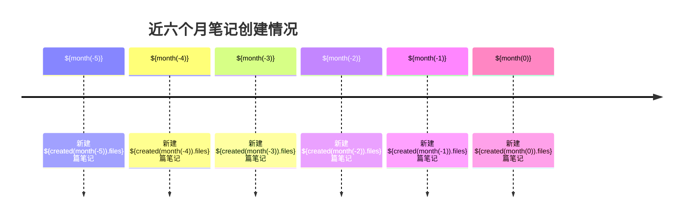

```mermaid
timeline
    title 近六个月笔记创建情况
    ${month(-5)} : 新建 ${created(month(-5)).files} 篇笔记
    ${month(-4)} : 新建 ${created(month(-4)).files} 篇笔记
    ${month(-3)} : 新建 ${created(month(-3)).files} 篇笔记
    ${month(-2)} : 新建 ${created(month(-2)).files} 篇笔记
    ${month(-1)} : 新建 ${created(month(-1)).files} 篇笔记
    ${month(0)} : 新建 ${created(month(0)).files} 篇笔记
```
