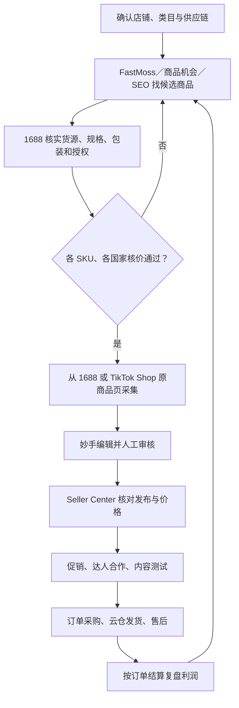

## tiktok_跨境电商（优化版）

```meta-bind-embed
[[笔记抬头模块]]
```

> 用于重新走通一次「选品 → 核价 → 上架 → 获客 → 履约 → 复盘」。以 [[tiktok_跨境电商|原始实操笔记]] 为主线，补充课程原理与项目资料，完整保留原笔记截图。原笔记和原始资料不变；账号、密码、收件信息不在本笔记中记录。

> [!warning] 使用边界
> 课程日期为 **2026-08-28**，首次资料核对日期为 **2026-08-31**，原笔记增补内容同步至 **2026-09-03**。本文中的费率、汇率、物流价格和销售数据均须区分“资料快照”与“当前经营参数”。课程示例不是平台统一标准，核价结果不是实际结算利润。本文没有登录店铺后台核验实时费用或履约期限。

### 快速导航

- [[#一、先明确经营链路与准备条件]]
- [[#二、完整图文操作实录]]
- [[#三、选品方法优化：先找需求，再验证自己能否交付]]
- [[#四、核价：把成交价、挂牌价和利润分清楚]]
- [[#五、上品：无论从哪里采集，都要重新核实商品信息]]
- [[#六、发布与多国家校验]]
- [[#七、促销与平台活动]]
- [[#八、达人合作与样品成本]]
- [[#九、数据复盘：判断下一步该改什么]]
- [[#十、订单采购与云仓履约]]
- [[#十一、执行检查单]]
- [[#十二、待核实问题与来源]]

## 一、先明确经营链路与准备条件

这次课程的重点是东南亚跨境小包直邮。老师建议先关注新加坡、马来西亚的利润机会；这是课程针对当时商品和成本的选择，不能据此认定其他国家一定不能做。其他国家应逐个核价、核实承运和售后成本，再决定是否开启。〔课程 00:12:29–00:17:20〕



### 工具分工

| 工具或资料 | 在流程中解决什么问题 |
| --- | --- |
| FastMoss | 看市场、商品、店铺和达人数据，形成选品假设 |
| 1688 | 找货源，确认具体 SKU、采购价、包装重量、发货和退货条件 |
| 八国核价系统 | 按地区、类目和物流渠道拆解成本，反推目标售价 |
| 东南亚五国自动核价系统 | 累计记录选品与五国价格，跟踪核价结果；使用前检查本文列出的差异 |
| 妙手 ERP／跨境 ERP 助手 | 采集商品、关联店铺、编辑和发布；店小秘是课程演示的替代路径 |
| TikTok Shop 商品页 | 在 FastMoss 验证商品后，作为英文标题、描述和图片的采集来源；不能代替 1688 供应链核实 |
| TikTok Shop Seller Center | 确认真实上架状态、站点价格、活动、联盟、商品机会、新店任务、订单和结算 |
| 战斧浏览器 | 使用团队已配置的店铺工作环境；网络异常按团队配置排查 |
| 快迈云仓 ERP | 东南亚订单采购信息、国内物流单号和仓库处理衔接 |

**开始前确认：** 店铺主体与站点正确，已完成所需审核和保证金事项，仓库与退货地址已确认，妙手已有对应店铺授权。根据《跨境开店.docx》，主要顺序是注册与法人验证 → 审核 → 保证金与物流设置 → 店铺工作环境 → 妙手授权。具体资料、地址和账号从内部档案取，不复制到公开笔记。

## 二、完整图文操作实录

> [!info] 阅读方式
> 本节按原笔记的操作先后保留 **99 张截图和全部主要步骤**，用于跟着界面连续操作；文字只做纠错、补充过渡和脱敏。后续章节解释为什么这样做、核价怎么算，以及哪些课程操作不能直接照搬。平台界面更新后，以当前后台名称和提示为准。

### 1. FastMoss 选品与 1688 核价

![[Pasted image 20260830143912.png]]

进入fastmoss：
[https://www.fastmoss.com/zh/e-commerce/newProducts](https://www.fastmoss.com/zh/e-commerce/newProducts)
账号：131****3925（【已脱敏】）
密码：【已脱敏】

#### 查看大盘数据
![[Pasted image 20260830152157.png]]

#### 商品
商品搜索是我想做一个品，然后去看具体商品的竞争和数据
没有明确目标的话就看“新品榜”（基本上是3日销量，可以看跨境店和本土店的对比）、“”

#### 新品榜
选择地区、商品分类、店铺类型
然后查看具体的商品信息
![[Pasted image 20260830153055.png]]
点击查看具体商品
![[Pasted image 20260830153544.png]]

查看销售渠道
![[Pasted image 20260830153640.png]]

成交价格
![[Pasted image 20260830153658.png]]

这个商品在本土店有表现，下一步去 1688 核实货源、利润和差异化条件；本土店能卖不等于跨境店可以直接复制。

复制商品图片
![[Pasted image 20260830154819.png]]

打开1688
https://re.1688.com/

搜索图片
![[Pasted image 20260830154929.png]]

调整框选主体
![[Pasted image 20260830155019.png]]

我们选定一个商品之后，在价格差不多的情况下，尽量去选1688给品牌代工的工厂（质量会比较好）

假如选择了匹克品牌，34.55价格的这个商品
![[Pasted image 20260830155400.png]]

接下来就开始进入合价阶段了

#### 合价
打开：“八国核价系统.xlsx”

这里合价的公式是用整体的，就是我们的销售额，然后去减去销售成本，再减去营销成本。然后再减去海外物流，再减去我们的整体的商品本身的成本，就得到了我们最终利润的一个算法。
![[Pasted image 20260830160317.png]]

计算方法、费率版本差异和工作簿公式问题见 [[#四、核价：把成交价、挂牌价和利润分清楚]]。

开始合价
将刚刚挑选好的商品价格录入到excel
![[Pasted image 20260830161016.png]]

商品重量需要和客服确认，是不是商品+外包装盒整体的价格（否则可能在运费上造成亏损）

填写完成后进入“八地区核价明细”表
![[Pasted image 20260830161316.png]]

可以看到所有国家的价格已经计算好了
![[Pasted image 20260830162040.png]]

然后看一下市场竞争价格
![[Pasted image 20260830162414.png]]

课程示例中，马来西亚核价结果比所选竞品价格低约 90 MYR，因此进入进一步验证；仍需确认两边 SKU、活动价、品牌／IP、费率与物流口径一致，不能仅凭价差直接判定可做。
![[Pasted image 20260830162632.png]]

接下来就可以上架了

### 2. 妙手采集、AI 编辑与发布

安装并使用浏览器插件[跨境ERP助手](https://erp.91miaoshou.com/help_center/article_3250.html)
![[Pasted image 20260830171915.png]]

绑定之前创建好的店铺
![[Pasted image 20260830172248.png]]

![[Pasted image 20260830172856.png]]

![[Pasted image 20260830173933.png]]

去采集箱查看采集好的商品
![[Pasted image 20260830173827.png]]

![[Pasted image 20260830175402.png]]

将采集好的商品关联到自己的店铺
![[Pasted image 20260830175603.png]]

![[Pasted image 20260830175813.png]]

关联店铺成功后，编辑商品符合平台的要求进行上架

删除无授权品牌或 IP 信息。只有实际商品及素材具备相应权利时，才能使用自有品牌和 Logo；否则按真实品牌／无品牌状态填写。
![[Pasted image 20260830180336.png]]

检查一下商品图片

品牌按实际商品和授权填写；店铺名称不自动等于商品品牌。
![[Pasted image 20260830180826.png]]

可用 AI 辅助匹配属性，但必须逐项核实；必填项完整、准确，可选项未知时先向供应商确认，不能为了达到比例而猜测。
![[Pasted image 20260830180601.png]]

原产地、保质期和保修按商品真实情况与目标站点要求填写。课程演示中的留空、12 个月和国际保修不是通用默认值。
![[Pasted image 20260830181000.png]]

销售属性/SKU信息，不要太长，不要翻译的信息也去掉
![[Pasted image 20260830181258.png]]

让ai帮忙写商品简介
提示词：
```
帮我根据图片写tk的商品详情页简介，不用带匹克的品牌名字,面向国家马来西亚和新加坡，要求有tk用户的搜索关键词
```
![[Pasted image 20260830181557.png]]

![[Pasted image 20260830183057.png]]

生成好后填写到商品详情页中
![[Pasted image 20260830183128.png]]

点击批量翻译，处理图片
![[Pasted image 20260830181910.png]]

智能消除（仅处理有权使用素材中的多余文字或背景；不得通过遮挡品牌规避审核）
![[Pasted image 20260830181956.png]]
![[Pasted image 20260830182109.png]]
![[Pasted image 20260830182229.png]]

消除完成后保存
![[Pasted image 20260830182330.png]]


接着翻译图片中的文本内容为，我们经营国家的语言（从中文翻译为英文）
![[Pasted image 20260830182439.png]]

查看一下翻译后的效果，确认并保存
![[Pasted image 20260830182812.png]]

按目标站点要求处理 SKU 图片语言，并核对译文与实际规格一致
![[Pasted image 20260830183353.png]]

开始改价格，改价格可以批量操作
![[Pasted image 20260830183609.png]]

我们当时刚才是按照34.9基础款核的。合完的价格？34块9我现在绑的是新加坡地区的店，我要和新币下来的话，我对外的市场营销价是卖76。我控利润的价格是38如果我按照38新币来卖的话，我一单按照15%净利润是31块钱。我就把这个改一下。改成76.77新币那就78然后改成78新币了之后你看这，这是有32块9的，我再用32块9再去做就是多 sku，它上线比较麻烦，繁琐一点。74块9但也是我们跨境商家能够有机会的，因为本土的话，他备不这么多货。
![[Pasted image 20260830185125.png]]

![[Pasted image 20260830185337.png]]

![[Pasted image 20260830190456.png]]


价格修改完成之后批量修改库存（库存不要改太多）
![[Pasted image 20260830190200.png]]

如果这个商品想要多国家售卖
![[Pasted image 20260830190631.png]]

设置商品尺码表
![[Pasted image 20260830191513.png]]

最后核对一下物流信息后保存并发布
![[Pasted image 20260830191547.png]]
![[Pasted image 20260830191611.png]]

前往发布记录
![[Pasted image 20260830191710.png]]
![[Pasted image 20260830191732.png]]

妙手ERP发布成功后，进入tiktok商家中心后台进行商品管理
[TikTok Shop Seller Center](https://seller.tiktokshopglobalselling.com/product/manage?shop_region=SG)
![[Pasted image 20260831142033.png]]

修改商品
![[Pasted image 20260831142537.png]]

检查一下基本信息
![[Pasted image 20260831142711.png]]

注意修改一下sku名称
	![[Pasted image 20260831144137.png]]

注意一下物流信息，跨境物流成本是否正确
![[Pasted image 20260831144247.png]]

逐国核价并核对物流、费率与平台限制后，再打开对应国家
![[Pasted image 20260831144338.png]]


对着合价表看一下对不对
![[Pasted image 20260831144524.png]]

统一修改库存
![[Pasted image 20260831145104.png]]

![[Pasted image 20260831145954.png]]

更新，同步，全选
![[Pasted image 20260831151206.png]]

发布完成，接下来去做营销活动

### 3. 商品优化、活动与达人营销

#### 促销活动
![[Pasted image 20260831152734.png]]

修改活动名称
![[Pasted image 20260831152845.png]]

选择百分比折扣，然后选择要折扣的商品
![[Pasted image 20260831152948.png]]

已参加活动的就不能选择了，我们选择刚刚上架好的商品，可以一次性选择多个
![[Pasted image 20260831153127.png]]

注意折扣的逻辑与国内是相反的（比如要打六折的话就填写40%）
![[Pasted image 20260831153331.png]]

填完之后看一下价格
![[Pasted image 20260831153644.png]]

同意并发布
![[Pasted image 20260831153758.png]]

促销活动就创建好了

#### 营销活动
参加平台的活动，评估情况利润能包的住就参加，优先报平台全部承担的活动
![[Pasted image 20260831165217.png]]


#### 联盟广场
和达人进行建联合作
![[Pasted image 20260831165657.png]]

#### 公开合作设置
新店开张进行公开的宣传

全选，编辑标准佣金
![[Pasted image 20260831171257.png]]

![[Pasted image 20260831171145.png]]

自动新增商品
之后所有新增的商品，都自动设置统一的“标准佣金率”、“店铺广告佣金率”
![[Pasted image 20260831171640.png]]

![[Pasted image 20260831171732.png]]


#### 自己去找一些达人

可以按类目去找
![[Pasted image 20260831172001.png]]

筛选类目和受众匹配的达人，并综合看相关内容的播放、成交、客单价与数据周期；粉丝量不能单独作为判断依据。

点击进入详情页
![[Pasted image 20260831172301.png]]

发出邀请后，达人可能不关注私信信息，所以需要留言，或者加达人的whatsapp
![[Pasted image 20260831172509.png]]

或者在tk手机上关注达人主页，看达人视频，留言进行邀请
![[Pasted image 20260831172559.png]]

以上就是邀约达人的方式

如何评估达人的投产比，看数据
![[Pasted image 20260831173403.png]]

以上就是 erp ai 辅助上架，上完了之后店铺活动运营，再加上店铺达人这块的公开计划。这就是我们现在可以涉及到最最初的一个链路。

### 4. 商品发布后的数据分析

数据分析，店铺数据分析
![[Pasted image 20260831173727.png]]

商品卡
![[Pasted image 20260831173920.png]]

配置指标，展示所有数据进行分析
![[Pasted image 20260831174123.png]]

![[Pasted image 20260831174157.png]]

![[Pasted image 20260831174211.png]]

短视频内容分析
![[Pasted image 20260831174701.png]]

平台推荐，从同类型视频获取灵感
![[Pasted image 20260831174753.png]]


#### 店铺的销售订单信息
![[Pasted image 20260831175057.png]]

### 5. 客户下单后的采购与履约

#### 1688采购

东南亚 ERP 货代系统：快迈云仓。入口与凭据从内部工具档案获取，本笔记不保存账号密码。

#### erp仓储履约

原笔记的订单履约部分没有继续记录采购单号、国内快递单号、云仓处理和取消订单的衔接。完整补充流程见 [[#十、订单采购与云仓履约]]。

### 6. 新店助手：确认获客通道并完成新手任务

新店商品要获得订单，不能只完成上架。当前主要获客通道包括：

1. **达人：** 通过公开合作、定向邀约和样品合作获得内容与成交。
2. **短视频：** 自制或达人内容将用户带到商品详情页。
3. **商品卡：** 依靠标题、关键词、主图、价格和商品信息承接搜索及推荐流量。

先在 Seller Center 首页确认当前登录的店铺、站点和账号，再进入“新店助手”。

![[Pasted image 20260903145451.png]]

打开“新商成长激励”，查看当前阶段、任务期限、完成条件和奖励规则。

![[Pasted image 20260903145552.png]]

领取任务后按后台要求执行，并回到任务页确认状态已经更新；仅点击领取不代表任务完成。

![[Pasted image 20260903145652.png]]

### 7. 新上品方式：从 TikTok Shop 原商品页采集

这条路径只改变**采集来源**，选品、1688 供应链确认、核价和发布后的检查仍然保留。

1. 在 FastMoss 选择目标国家和类目，并把店铺类型限定为**跨境店**。进入候选商品详情后，点击入口跳转至该商品的 TikTok Shop 原页面：<https://shop.tiktok.com/>。

![[Pasted image 20260903152447.png]]

2. 在 TikTok Shop 商品页使用跨境 ERP 助手采集商品。采集前确认浏览器插件关联的是正确妙手账号和目标店铺。

![[Pasted image 20260903152635.png]]

3. 回到妙手采集箱，将商品关联到正确国家和店铺。TikTok Shop 来源通常已有英文标题、描述和图片，可以减少翻译工作，但仍要逐项检查类目、品牌、规格、图片权利、禁限售信息及描述与实物是否一致。
4. 在 1688 确认实际供货 SKU、采购价和完整包装重量，再用核价表判断每个国家的成交价与利润是否包得住。TikTok Shop 页面上的售价是竞品信息，不能当作采购成本。

![[Pasted image 20260903153118.png]]

5. 在妙手逐个填写 SKU 价格，同时检查库存、重量、尺寸和规格映射。不同成本的 SKU 不要机械填写同一价格。

![[Pasted image 20260903153220.png]]

6. 保存并发布到 TikTok 店铺。后续仍按原流程在 Seller Center 核对审核状态、各国家价格、库存、物流预估、促销和联盟设置。

### 8. 商品机会与商品 SEO

Seller Center 的“商品机会”会根据店铺和平台数据展示高潜力商品。它适合补充候选池，不等于平台承诺销量；先核对目标国家、类目和推荐周期，再回到 1688 与核价表验证能否供货、合规销售并获得利润。

![[Pasted image 20260903153956.png]]

在商品机会的 SEO 功能中添加与现有商品真实相关的关键词，查看需求和供给情况。

![[Pasted image 20260903154435.png]]

选择需要分析或优化的已上架商品。

![[Pasted image 20260903154523.png]]

将相关关键词加入标题或商品信息前，先确认词义与商品、SKU 和目标站点一致；不要为了流量堆砌无关词。

![[Pasted image 20260903154554.png]]

搜索次数明显高于在售商品数时，可以把对应商品方向加入候选池；还要继续检查时间范围、趋势稳定性、竞争商品质量、供应链和利润，不能只凭一个差值直接上品。

![[Pasted image 20260903154810.png]]

> [!success] 图文实录已完整保留
> 到这里，原笔记的 99 张截图和主要操作步骤已按原顺序全部呈现。下面进入优化分析：补充选品判断、核价推导、内容合规、数据诊断和履约检查，避免只会跟着界面点击而不知道如何判断结果。

## 三、选品方法优化：先找需求，再验证自己能否交付

### 1. 五种选品入口

1. **跟新品：** 没有明确目标时，从目标国家、类目的新品榜中找正在出单的商品。
2. **供应链反推：** 已有可靠工厂、稳定货源、价格或设计优势时，反查对应三级类目的需求。
3. **跟标杆店铺：** 找经营模式相近的店铺，分析其商品结构、成交价和获客方式，再算自己能否复制。
4. **商品机会：** 从 Seller Center 的平台推荐中找候选品，再核查推荐站点、周期、供应链和利润。
5. **SEO 供需差：** 找与店铺类目相关、搜索量较高而在售商品较少的关键词，反查可以真实承接该需求的商品。

课程先演示跟新品，后面补充了供应链与标杆店铺方法；商品机会和 SEO 是 2026-09-03 原笔记新增的后台入口。不要只看“卖了多少单”或一个关键词差值，还要回答“需求来自哪里、它为什么能卖、我们具备哪些条件”。〔课程 00:03:04–00:10:59；01:01:49–01:14:59〕

### 2. FastMoss 的查看顺序

入口：[FastMoss 新品榜](https://www.fastmoss.com/zh/e-commerce/newProducts)。以下菜单与截图是课程时点的操作参考。

1. **大盘与类目：** 选择国家和日期，观察需求、价格带、头部集中度。尽量落到具体三级类目，不用整个大盘均价判断某个商品。
2. **新品榜／商品搜索：** 选国家、分类、店铺类型；为跨境店选品时明确限定为跨境店，已有明确商品时直接搜索。
3. **商品详情：** 确认上架时间、店铺经营时间、销量周期、SKU 与价格区间。
4. **成交来源：** 区分商品卡、短视频、直播，以及商家自营与达人合作。已有店铺的自然流量不代表新店也会自然起量。
5. **价格可比性：** 看同规格的实际售价，记录是否为引流 SKU、套装、联名款或活动价。

> [!tip] 羽毛球拍案例真正要学的判断
> 课程竞品含 IP 联名因素，店铺也有较长经营积累。普通无品牌双拍、品牌套装与联名礼盒不是同一个商品；看到别人卖得贵，只能说明值得进一步核价，不能直接推出“我更便宜，所以一定能卖”。〔课程 00:17:20；00:21:32；01:01:49〕

### 3. 商品机会与 SEO 需求验证

商品机会和关键词供需差都只能形成**选品假设**。建议为每个候选项记录：站点、类目、关键词、统计周期、搜索次数、在售商品数、代表性竞品价格、内容来源和记录日期。

按以下顺序筛选：

1. 确认关键词与实际商品和目标 SKU 相关，不把近义但不同用途的商品混在一起。
2. 打开代表性商品，检查价格、销量、评价、上架时间和流量来源，排除单一爆款或强品牌带来的偏差。
3. 去 1688 核实供应商、授权、包装重量和采购成本，再逐站点核价。
4. 通过后才进入采集和小批量测试；未通过的商品记录淘汰原因，避免重复核算。
5. 已上架商品做 SEO 时，只添加准确、自然的关键词，并记录修改前后的曝光与点击数据。

“搜索次数明显高于在售商品数”通常表示值得继续研究，但不直接证明竞争低或一定能成交。搜索与在售的统计口径、周期和站点必须一致，还要考虑季节、价格带、履约难度与合规风险。

### 4. 1688 找货与供应商确认

复制候选商品图片，在 [1688](https://re.1688.com/) 以图搜款，框选商品主体，再比较规格与供应条件。

至少向供应商确认以下信息，作为核价输入：

- 具体 SKU：型号、颜色、数量、材质、配件、是否带包，与目标商品是否一致。
- 采购成本：该 SKU 的实际价格、起订量、一件代发条件、国内运费、批采条件。
- **完整包裹重量与尺寸：商品 + 配件 + 商品包装 + 发货外包装。** 单拍净重不能代替双拍套装发货重量。
- 供货与售后：库存、补货时间、当天截单时间、质量问题处理、退货条件。
- 商品与素材权利：是否可以合法销售、使用图片及相关品牌信息；“给品牌代工”不等于拥有该品牌授权。

**建议询价模板：**

```text
请确认这款商品【型号／颜色／套装内容】的一件代发价格及国内运费。
请提供完整发货包裹的实称重量、长宽高，并说明是否包含全部配件和外包装。
请确认可售库存、截单与发货时间、缺货替代方案及质量问题退货规则。
请说明实际交付商品上的品牌标识，以及商品销售和图片使用的授权情况。
```

## 四、核价：把成交价、挂牌价和利润分清楚

### 1. 两张表各自怎么用

两份文件均位于 `D:\tk-sea-seller\00-资料\`，不要混用它们的参数和结论。

**《八国核价系统.xlsx》：**

1. 在 `商品一次录入` 填黄色输入区：类目、商品、采购、国内物流、打包费、实重与长宽高。成本不同的 SKU 分别核价，备注清楚。
2. 在 `汇率表` 维护汇率，口径为 **1 单位当地币 = 多少人民币**。
3. 在 `地区类目参数` 确认国家 × 类目的平台费用、销售费用、目标利润和折扣系数。
4. 在 `物流渠道参数` 检查单价、票费、实重／材积规则、尺寸限制、启用状态。
5. 在 `八地区核价明细` 读取各国结果，填写同口径竞品价格，检查渠道结果后再作决定。

**《TikTok东南亚五国自动核价系统-户外运动类目.xlsx》：**

- `每日累计核价`：填写商品、成本、重量和五国竞品价格，保留日期和来源。
- `单品五国明细!B3`：输入序号查看明细；当前文件的商品名称显示存在问题，见下文。
- `参数设置`：维护五国经营参数；这张表没有八国表那样的多类目选择。
- `物流规则`：保留分区、起重、续重与尾程资料；**主表实际采用重量 × RMB/kg 的简化计算**。
- `每日统计`：汇总日期与结论；前提是主表日期、公式和“保留”口径可靠。

### 2. 核价公式及单位

把销售额记为 `P`，以人民币计；先按表内简化模型计算：

```text
固定成本 C = 采购成本 + 国内运费 + 包装/打包费 + 卖家承担的跨境物流
平台费率 r平台 = 平台佣金 + 交易手续费 + 平台服务费 + 表内税费
销售成本率 r销售 = 达人佣金预算 + 广告预算 + 提现费预算 + 退货损耗预算
目标利润率 m = 目标单笔利润 ÷ 成交收入

P × (1 - r平台 - r销售) - C = P × m
目标成交价 P（RMB）= C ÷ (1 - r平台 - r销售 - m)
当地币成交价 = P ÷ 汇率（RMB/当地币）
规划挂牌价 = 当地币成交价 ÷ 折扣系数 d
模型目标利润（RMB）= P × m
```

这里的“目标利润”只覆盖模型列出的费用，**不自动包含工资、软件订阅、仓租等全部经营成本**。不同费用也未必采用同一个计费基数；表中直接相加是估算模型，正式定价应按当前账单口径核实，后续用实际结算复盘。

要特别区分：

- **目标成交价：** 在指定成本和费用假设下，达到目标利润率所需的价格。
- **零利润保本价：** 在同一模型下把 `m` 设为 0 后算出的价格。不要把它和目标成交价混称“底价”。
- **规划挂牌价：** 为价格方案测算的数值；它不等于有资格展示的“原价”，也不是第二笔销售收入。
- **折扣系数：** 五折对应 `d = 0.5`；若后台填的是“减免百分比”，五折填 50%、六折填 40%，最终仍看价格预览。

计算前检查 `1 - r平台 - r销售 - m > 0`，且 `0 < d ≤ 1`。空白费用表示未知，不等于没有成本；确认不发生的费用才填 0。

### 3. 课程羽毛球拍示例复算

以下采用**课程初次核价的采购价 34.55 元**、国内运费 0 元、打包费 2 元、完整包裹 550g，结合八国表读取到的新加坡参数复算。课程后面的多 SKU 演示还出现 34.9 等采购价，不混入同一个算例。〔课程 00:15:25–00:17:20、00:31:52〕

| 项目 | 输入或计算结果 |
| --- | --- |
| 跨境物流参考单价 | 83.56 RMB/kg |
| 跨境物流 | 0.55 × 83.56 = **45.958 元** |
| 固定成本 | 34.55 + 0 + 2 + 45.958 = **82.508 元** |
| 平台费率合计 | **18.265%** |
| 销售成本率 | 10% 达人 + 10% 广告 + 2% 提现 + 5% 损耗 = **27%** |
| 目标利润率 | **15%** |
| 目标成交价 | 82.508 ÷ 0.39735 = **207.65 元** |
| 汇率快照 | **5.4328 RMB/SGD** |
| 新加坡目标成交价 | **38.22 SGD** |
| 五折系数下规划挂牌价 | **76.44 SGD** |
| 模型目标利润 | 207.64565 × 15% ≈ **31.15 元／单** |

来源定位：八国表 `物流渠道参数!E12`、`地区类目参数!G15:R15`、`汇率表!C10`。**这是复算值，不是当前工作簿示例行的商品结果，也不是实时售价建议。** 上架前还要按平台价格精度处理舍入，并重新核验利润。

课程里的“约 38 新币成交、约 76 新币挂牌、约 31 元利润”因此有可解释的计算关系。若重量少填 100g，在其他条件不变、按该物流模型计费时，成本会增加约 **8.36 元**，利润从约 31.15 元降到约 22.79 元。这就是包装重量比文案细节更早需要确认的原因。

### 4. 两套表的费率不一致，不能交叉套用

下表是 **2026-08-31 本地文件读数**，不是对各国当前平台费率的认定。平台费率合计均按各自表内四项费用相加：

| 国家 | 八国表 | 五国表 |
| --- | --- | --- |
| 泰国 | 37.520% | 33.220% |
| 马来西亚 | 34.780% | 29.440% |
| 菲律宾 | 19.740% | 14.540% |
| 越南 | 25.000% | 31.000% |
| 新加坡 | 18.265% | 20.445% |

八国表定位：`地区类目参数` 的运动户外行 7、9、11、13、15，G:J 列；五国表定位：`参数设置!E5:H9`。

同样的 34.55 元／550g 商品，仅换用五国表的新加坡平台费率，目标成交价就变成约 **40.44 SGD**、规划挂牌价约 **80.88 SGD**。马来西亚用八国表参数复算的规划挂牌价约 **254.00 MYR**，用五国表约 **206.51 MYR**，均不能直接当作课程口述约 201 MYR 的原始精确结果。

**处理方法：** 先选定一个版本，逐项核实类目、适用日期、费用是否含税及是否重复计入，再重新核价。资料不足时保留“待确认”，不要自行挑更便宜的结果。竞品约 297 MYR 也可能受 SKU、活动和 IP 溢价影响，因此原笔记的“便宜九十多，所以可以做”应改为“值得继续验证”。

### 5. 表格结论需要人工复核

本次读到五国表中三个具体问题，**只记录问题，未修改原 Excel**：

- `每日累计核价!AJ8` 的竞品数量判断包含 `COUNT($M8,$R8,$W8:$V8,$AB8,$AG8)`。其中 `V8` 是我方菲律宾挂牌价，却被一起算作已填写的竞品数据；可能在尚缺竞品价时过早判为“淘汰”。相邻行也存在同样写法。
- `单品五国明细!C5` 的商品名称是固定文本 `2.1`，不是随 `B3` 序号联动的公式；不要仅凭这个名称确认正在核算哪个商品。
- `公式说明!B15` 用 `SUM('每日累计核价'!$F$8:$H$7)`，范围跨到第 7 行表头。当前文本表头可能不改变求和结果，但示例引用应核对，不能仅凭说明页认为全部公式正确。

两张表的“保得住／保留”本质上是条件筛选：表中把竞品价格与我方规划挂牌价比较；它**没有验证竞品价格到底是挂牌价还是成交价，也不保证需求、授权、库存和真实利润**。五国表“任一国家通过即保留”表示商品有待继续验证的国家，不表示五国全部可以上。

### 6. 物流和营销场景检查

- 核价要逐国家做；ERP 自动换汇无法代替不同国家的运费、费率和类目计算。
- 八国表支持按实重或实重／材积取大，取决于具体渠道参数。当前东南亚示例渠道设置为按实重，不代表所有渠道永远如此。
- 五国表主表的 `重量 × 单价` 没有完整逐单执行价卡中的起重、续重、分区、尾程规则。轻小件、临界重量和特殊区域尤其要拿实际运费复核。
- 后台显示的买家运费，不自动等于卖家不用承担跨境物流；分清是谁收取、谁支付，避免漏算或重复算。
- 达人或广告预算只能在明确不用相应渠道时调整。将它们填 0 不会让获客自动发生；自制内容、样品和人工仍可能产生费用。〔课程 01:04:41–01:14:59〕

## 五、上品：无论从哪里采集，都要重新核实商品信息

### 1. 选择采集路径并关联店铺

参考原笔记的 [跨境 ERP 助手说明](https://erp.91miaoshou.com/help_center/article_3250.html)，目前有两条采集路径：

- **从 1688 采集：** 适合直接取得供应商商品信息；采集后通常需要翻译、重写和素材审核。
- **从 TikTok Shop 原商品页采集：** 在 FastMoss 找到跨境店商品并跳到原页面采集；英文标题、描述和图片可减少处理步骤，但必须确认素材权利和信息与实际 1688 供货 SKU 一致。

两条路径都要执行：进入妙手采集箱 → 关联正确的 TikTok 店铺与国家 → 编辑商品 → 逐 SKU 核价 → 人工审核。开始前同时核对当前浏览器登录的 FastMoss、妙手和 TikTok Shop 账号，避免采集或发布到错误店铺。使用当前官方渠道提供的插件版本，项目中的安装包只作存档，不默认是最新版本。

### 2. 商品内容审核顺序

**先确认卖的是什么，再生成怎么卖的文案。**

1. **类目与品牌：** 选择真实类目。按实际商品品牌及授权填写；店铺名不自动等于商品品牌。
2. **标题：** 商品核心词 + 已核实规格／套装 + 使用场景；不加入无授权品牌、IP 或无法证明的卖点。长度以该站点当前字段限制为准，课程的“250 字符”只作当时演示参考。
3. **商品属性：** 必填项全部填对，可选项尽量补齐，但未知项先确认。不能为了“填满 2/3”虚构属性。
4. **SKU：** 名称简短且有区分度，颜色、数量、配件、型号与采购 SKU 一一对应；所有语言版本都检查长度。
5. **详情与图片：** 对照实物审核材质、数量、颜色、尺寸、重量、质保、配件；图片和文字应互相一致。
6. **价格与库存：** 每个成本不同的 SKU 单独核价；库存按可兑现的供应量和交付能力填写，不把课程的“50／100”当作固定值。

> [!warning] 对原笔记几处操作的修正
> “删除原产地”“统一填 12 个月保质期／国际保修”“去掉其他品牌 Logo 后改成自己的品牌”不能作为通用 SOP。产品属性和承诺必须与实际商品一致；遮挡或改动品牌标识来规避识别，本身也可能违反品牌规则。新加坡官方规则明确涉及此类品牌规避行为；泰国商品发布指南要求品牌、属性、图片及保修等信息真实一致。其他站点应查对应规则。[新加坡品牌规避规则](https://seller-sg.tiktok.com/university/essay?knowledge_id=3154098615584514&lang=en)、[泰国商品发布指南](https://seller-th.tiktok.com/university/essay?knowledge_id=10009152&lang=en)。

### 3. 可复用的商品文案提示词

将确认过的商品事实提供给 AI，而不是只让 AI 看一张图猜参数：

```text
请为 TikTok Shop 商品编写上架草稿。

目标站点：【新加坡／马来西亚，分别输出】
目标语言：【按站点要求填写】
商品名称与真实品牌／无品牌状态：【填写】
已核实事实：【材质、尺寸、单件净重、套装数量、配件、颜色、适用场景】
供应商证据：【经过授权的图片、规格资料或实测结果】
后台字段限制：【填写当前标题和SKU长度限制】
尚未确认的信息：【列出，不得自行补全】

请输出：
1. 适合搜索的商品标题，关键词自然融入，不堆砌。
2. 五条有事实依据的卖点；证据不足时少写，并说明待确认项。
3. 商品详情：使用场景、规格、包装清单、使用与保养注意事项。
4. 简短且互不混淆的SKU名称。
5. 对应的中文核对稿，以及每项待确认信息。

禁止虚构品牌授权、联名、认证、材料、性能、原产地或保修承诺。
禁止把单件净重当作完整包裹重量，也不要根据图片推断套装全部配件。
```

### 4. 翻译与已有素材复用

先核对图片使用权限，再处理授权素材中的文字翻译、版式和背景。检查译文是否改变规格或承诺；需要替换不合规素材时，应换成真实、可使用的商品素材，不通过遮标来掩盖商品身份。

项目已有素材位于 `D:\tk-sea-seller\素材\NeonFrontier羽毛球拍双拍套装\`：主目录含英文详情图、规格图与尺码表，`主图英文版\` 有 9 张主图候选。可先复用经核实的图片，减少重做；9 张是现有素材数量，不是各站点必须上传的数量。

**素材一致性待确认：** `13-specifications-en.png` 写了 `Unbranded`、约 110g、约 665mm、18–22 lbs；它们只是现有图片上的文字，尚未据实物确认。目录名含 NeonFrontier，也不能证明实际商品属于该品牌。课程另有不同重量和商品案例，不能混用。主图中呈现的拍子、球和套装数量也须逐 SKU 对照发货清单。

## 六、发布与多国家校验

### 1. 在妙手提交

完成类目、商品内容、SKU、价格、库存、尺码或规格图、物流重量与尺寸检查后，保存 → 选择正确店铺 → 发布 → 查看发布记录。区分“处理中”“失败”和“成功”，不要连续重复发布制造重复商品。〔课程 00:31:52–00:44:59〕

### 2. 在 TikTok 店铺后台验收

进入 [TikTok Shop Seller Center](https://seller.tiktokshopglobalselling.com/product/manage?shop_region=SG)，切换实际发布的国家，在商品管理中找到该商品。

逐项核对：

- 商品是否已通过所需审核并可售，失败站点是什么原因。
- 商品标题、翻译、品牌和 SKU 是否与妙手保存版本一致。
- 包裹重量、尺寸和卖家跨境物流预估是否与核价一致。
- 每个国家、每个 SKU 的币种与价格是否对应正确。
- 库存是否可兑现；活动价格是否仍达到本次核价目标。

**只开启验证通过的国家。** 原笔记中“把其他国家全部打开”应增加这一条件。课程中的越南价格上限数值、自动换汇值及某次运费显示，都不作为长期固定规则抄入新商品；以当前站点页面提示复核。

## 七、促销与平台活动

### 1. 店铺促销

商品发布完成后，在促销活动中创建活动，设置名称、时间和商品，再设置折扣并预览。〔课程 00:44:59–00:47:09〕

假设某 SKU 的合法、可使用的挂牌价格是 80，当后台字段表示“减价百分比”时：填 40% 后成交价为 `80 × (1 - 40%) = 48`。不能只看折扣框的数字，必须看最终价格预览。

核价表用“成交价 ÷ 0.5”规划价格空间，**不等于允许先虚增原价再制造折扣**。发布时保证价格与优惠展示真实；泰国官方发布指南明确禁止夸大促销价格或无依据的价格比较。[商品发布指南](https://seller-th.tiktok.com/university/essay?knowledge_id=10009152&lang=en)。

### 2. 平台活动

在营销活动／任务入口查看可报名活动、优惠券和补贴，先确认承担方，再决定报名：

- 店铺折扣：卖家通过降价承担。
- 平台券：可能全额由平台承担，也可能共同承担；看该活动规则及结算口径。
- 达人佣金、广告成本：通常还要按实际订单归因和费用规则计入，不能看到“平台补贴”就忽略。

课程演示了“优惠券 14%、若商家承担其中 7% 则重新算利润”的思路，这是活动示例，不是固定比例。〔课程 00:47:09〕

**报名检查顺序：** 商品折扣 → 可叠加券与门槛 → 卖家实际承担 → 达人／广告场景 → 最终收入与利润。平台全额承担的活动可优先评估，但仍需满足活动条件与履约能力。

## 八、达人合作与样品成本

### 1. 公开合作

进入联盟广场，选商品，按核价预留设置佣金；是否开启新增商品自动加入，要看新品审核机制，避免未核价商品自动进入不合适的佣金计划。〔课程 00:48:09–00:51:43〕

课程以标准佣金 10%、店铺广告佣金 5% 演示，并解释了广告归因订单的处理。它们是设置示例；**是否替代、叠加及适用哪些订单，要以当前联盟规则和订单账单为准**。分别算普通达人订单与使用达人素材投广告的订单，不机械地把所有百分比相加。

### 2. 主动找达人

1. 按国家、类目、受众和产品价位筛选。
2. 看相关视频的播放与成交表现，不只看粉丝数或达人整体 GMV。
3. 区分视频与直播能力，留意数据周期、内容数量和异常爆款。
4. 查看实际内容，判断能否展示本商品的使用场景与卖点。
5. 发出邀请，记录回复、佣金、样品、内容时间、素材使用授权及后续订单表现。

课程演示了联盟邀请、查看 TikTok 主页以及达人公开商务联系方式。实际联系应使用合适的商务渠道，不批量骚扰；本笔记不收录他人联系方式。〔课程 00:51:55–00:54:44〕

### 3. 样品先算回本门槛

**整理建议：** 免费样品不是零成本。可先用以下简化模型做筛选：

```text
单次合作投入 = 样品采购 + 包装与寄送 + 固定合作费用
每单可贡献利润 = 成交收入 - 商品与履约成本 - 该订单各项可变费用
回本订单数 = 向上取整(单次合作投入 ÷ 每单可贡献利润)
```

每单贡献利润必须为正，且样品投入与订单成本不能重复扣除。例如合作投入 100 元、每单贡献利润 20 元，至少需要 5 个有效结算订单回本；这是计算示例，不是对达人销量的预测。

课程还提到付费样品和达到条件后的返款机制，示例是“三单”。具体资格、订单有效性与返款条件尚未在当前后台核验，不能向达人直接承诺。免费样品也应先审核匹配度与成本，再决定是否批准。〔课程 00:50:07〕

## 九、数据复盘：判断下一步该改什么

入口：数据分析 → 店铺数据／商品卡；已经发内容时，再看短视频与直播分析。先选定时间、国家、商品和渠道，再比较数据。〔课程 00:54:44–00:58:12〕

### 1. 先把指标口径对齐

- **曝光人数**是去重人数，**曝光次数**是展示次数，不能混作同一分母。
- CTR 一般描述曝光到点击的比例，但具体用人数还是次数，按后台指标说明；比较时保持一致。
- 加购率、下单率、支付转化率先确认分子、分母和周期，不能把“加购率”直接理解成支付成交率。
- 课程所说的每千次曝光 GMV 是成交额效率，不是利润；广告 ROAS 也不是净利润率。

### 2. 用漏斗定位问题

以下是结合课程整理的排查框架，不是平台诊断结论：

| 观察到的现象 | 优先核查 | 下一步可测试的动作 |
| --- | --- | --- |
| 几乎没有曝光 | 可售状态、类目、标题相关性、内容或达人是否开展 | 排除上架问题后，补真实内容或小范围达人测试 |
| 曝光有了，点击少 | 主图、可见价格、商品与受众匹配 | 测试主图或标题，一次尽量只改一个关键因素 |
| 有点击，加购少 | 商品规格、卖点证据、详情、评价、价格与运费 | 补齐事实信息，检查用户点进来后是否发现不一致 |
| 加购有了，付款少 | 到手总价、配送预期、活动条件、可售库存 | 检查结账体验和费用，不直接靠更低折扣解决 |
| 有订单，利润差 | 实际重量、券承担、佣金、投放和退款 | 按结算单逐项对账，再调整国家、SKU 或活动 |

课程中某店铺约 4.54% 的点击率、8.33% 的相关转化指标只是一次演示；老师口述的平均区间没有独立核实，不能用作所有类目的合格线。尤其样本小时，不要从几单数据认定“只缺流量”。

建议记录 `国家 / SKU / 日期 / 曝光 / 点击 / 加购 / 支付 / 退款 / 实际利润 / 本次改动`，保留改动前后同口径数据，逐步积累自己的基线。

## 十、订单采购与云仓履约

这部分补全原笔记末尾未写完的流程。课程只演示了基本操作，本文把核对点补齐；没有据此承诺所有供应商或仓库都能固定时点发货。〔课程 00:58:47–01:00:50〕

### 1. 区分三个单号

| 单号 | 来源 | 作用 |
| --- | --- | --- |
| TikTok 平台订单号 | 店铺订单 | 对应顾客购买的 SKU、数量、状态和期限 |
| 1688 采购订单号 | 供应商采购 | 对应买了什么、买多少、向谁采购 |
| 国内快递单号 | 供应商发往云仓的包裹 | 供云仓识别来货与查询运输进度 |

**这三个单号不能互相替代。** 国内快递单号也不是当然可以回传为顾客订单的国际履约单号。

### 2. 按顺序操作

1. **确认平台订单。** 检查付款、取消／退款状态、SKU、数量、收货国家，以及后台显示的发货与交接期限；样品单和正常销售订单分别处理。
2. **确认供应商能供货。** 核对库存、采购价、型号、配件、重量与截单时间。采购前再查一次订单状态，避免已取消还继续下单。
3. **在 1688 采购。** 使用当前确认的云仓收货资料和所需入仓标识，记录平台订单与采购订单的对应关系；多包裹或拆单要分别记录。
4. **录入云仓 ERP。** 按当前界面，将采购订单号关联到正确的平台订单／待处理记录。系统入口在内部工具档案中维护。
5. **供应商发货后补单号。** 选择正确承运商，填写国内快递单号；不能用采购订单号代替物流单号。
6. **提交仓库处理。** 课程演示了补全单号后点击“一键打包”进入云仓排期。实际执行时确认该操作状态与仓库要求，并继续追踪到货、验收、称重与出库。
7. **核对平台履约状态。** 追踪正确面单、平台认可的物流信息和交接状态，直到订单在平台显示相应发货进度；采购完成不等于顾客订单已发货。
8. **处理取消与异常。** 买家中途取消时，先确认包裹在哪一段，再联系供应商／云仓拦截或退回，核实退款和运费承担。
9. **做结算复盘。** 记录实际采购、国内物流、云仓、跨境物流、平台扣费、营销扣费和退款，与核价假设对照。

### 3. 容易卡住的地方

- **供应商缺货：** 不擅自换颜色、型号或少配件；按真实订单和可用售后流程处理。
- **采购了却未录入 ERP：** 仓库可能无法关联包裹；及时补采购单号、物流单号和必要入仓标识。
- **商品已到云仓但未出库：** 查订单状态、仓库异常和截止时间，不能仅凭快递签收判断完成履约。
- **途中取消：** 先确认是否已发给消费者，不能对所有阶段都简单套用“退回 1688”。
- **实际费用高于核价：** 保留账单和称重依据，更新下一批商品参数；不要把一次亏损直接解释为售价问题。

## 十一、执行检查单

### 上架前

- [ ] 确认国家、店铺、类目与负责人，ERP 授权正确。
- [ ] FastMoss 已限定正确国家、类目和跨境店；或已记录商品机会／SEO 的站点、周期和供需数据。
- [ ] 候选品有需求依据，并记录可比 SKU 的竞品价格与日期。
- [ ] 已确认供应商、授权、完整包装重量与尺寸、库存和发货条件。
- [ ] 选定核价表版本，核实费率、汇率与物流；每个国家、不同成本 SKU 分别核价。
- [ ] 目标成交价、挂牌价、折扣与活动承担能够互相算回去。
- [ ] 采集前核对 FastMoss、妙手、TikTok Shop 的当前账号和目标店铺。
- [ ] 图片、标题、关键词、品牌、规格、SKU、配件及售后承诺与实际供货一致。

### 发布后

- [ ] 在 Seller Center 确认各站点可售状态，不只看 ERP 发布记录。
- [ ] 核对各国币种、每个 SKU 价格、库存和跨境物流预估。
- [ ] 预览活动最终价格与叠加条件；不达目标的活动不直接报名。
- [ ] 佣金和自动加入计划与商品核价一致；寄样前算成本。
- [ ] 保存测试前的指标，给每次主图、价格或内容调整留下记录。

### 每日优先事项

先看待履约、取消退款和仓库异常，再看商品异常、活动价格与新店助手任务，然后处理达人回复、商品机会、SEO 关键词、选品和内容测试。每个完成结算的订单都可用于修正核价假设；不要只统计上架数和 GMV。

## 十二、待核实问题与来源

### 下一步最值得确认的事项

1. **统一核价版本：** 两套表的费率由谁维护、适用日期是什么？佣金、税费、服务费的计费基数是否一致？
2. **修复五国表已发现的问题：** `AJ8` 及相邻行的竞品计数、`C5` 名称联动、说明页引用；修复后重新计算与复核，本文未代改。
3. **拿真实物流校准：** 包装后的重量、尺寸、起续重、票费、分区和尾程分别由谁承担？
4. **核实羽毛球拍素材与实物：** 真实品牌状态、110g 是否为单拍净重、套装组成、尺寸和磅数能否得到供应商或实测支持？
5. **确认履约时效：** 供应商截单、云仓处理、平台交接期限，以及取消后的分段处理办法。
6. **核实联盟规则：** 标准佣金与广告佣金如何归因；样品退款条件是什么？

### 本地资料索引

资料根目录：`D:\tk-sea-seller\`。以下说明实际使用范围；含账号的工作簿只用于确认资料位置与用途，不在此复制内容。

| 编号 | 来源 | 本文用途 |
| --- | --- | --- |
| S1 | [[tiktok_跨境电商]] | 实操主线、关键截图；完整历史截图保留在原笔记 |
| S2 | `00-资料\tk跨境电商_授课录屏\20260828132928-董悦预定的会议-逐字稿文本-1.txt` | 完整阅读逐字稿，按时间点补选品逻辑、营销、数据及履约 |
| S3 | `00-资料\八国核价系统.xlsx` | 输入区、费率、汇率、物流模型与价格复算 |
| S4 | `00-资料\TikTok东南亚五国自动核价系统-户外运动类目.xlsx` | 累计核价流程、参数差异、物流简化和公式问题 |
| S5 | `00-资料\上品操作详细步骤.docx` | 以图搜款、咨询真实包装、采集、编辑与发布流程的文字内容 |
| S6 | `00-资料\跨境开店.docx` | 开店和授权准备的文字步骤；不转载凭据和收件资料 |
| S7 | `00-资料\跨境小包直邮店铺分配.xlsx`、`软件工具-跨境信息档案表.xlsx` | 仅确认工作表结构及敏感档案用途，实际账号请查内部文件 |
| S8 | `素材\NeonFrontier羽毛球拍双拍套装\` | 清点素材文件，查看规格图和英文主图，记录实物一致性待确认项 |

`00-资料\data.md` 当前为空，没有作为知识来源。项目说明文件只辅助理解结构；其中旧文件清单、环境描述不作为本次事实依据。原始逐字稿有同音字、口误和数字粘连，本文保留时间定位，无法独立复算的数值不强行纠正为“确定值”。

### 课程回看定位

| 时间段 | 主题 |
| --- | --- |
| 00:03:04–00:11:25 | 选品入口、大盘、三级类目、跟新品和供应商 |
| 00:12:00–00:17:20 | 费用构成、包装重量、目标利润与核价示例 |
| 00:19:01–00:37:07 | 采集、编辑、AI 文案、图片翻译、SKU 与发布 |
| 00:38:30–00:44:59 | 店铺后台与各国家价格、物流核对 |
| 00:44:59–00:54:44 | 促销、平台活动、佣金、样品、达人筛选 |
| 00:54:44–00:58:47 | 商品卡、短视频和店铺数据 |
| 00:58:47–01:00:50 | 订单、1688 采购、单号录入与云仓 |
| 01:01:49–01:18:12 | 跟品与升级、供应链、标杆店铺、不同获客成本 |

官方规则链接用于修正商品真实性、品牌和促销表达的风险，不代表已完成五国全部类目合规审查。新加坡与泰国适用范围已在相应段落注明；具体店铺执行前仍应核对目标站点的当前要求。
